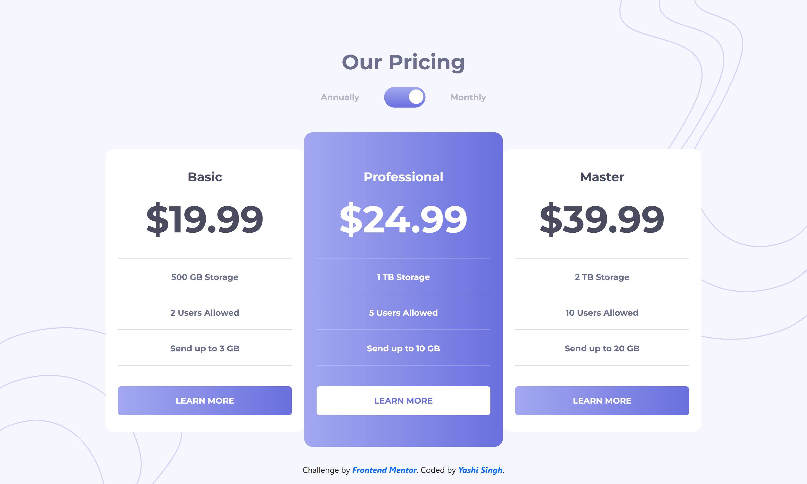
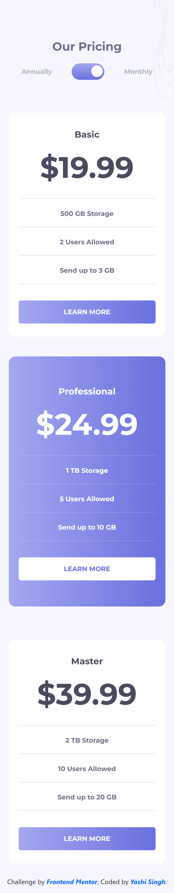

# Frontend Mentor - Pricing Component with Toggle solution

This is a solution to the [Pricing component with toggle challenge on Frontend Mentor](https://www.frontendmentor.io/challenges/pricing-component-with-toggle-8vPwRMIC). Frontend Mentor challenges help you improve your coding skills by building realistic projects.

## Table of contents

- [Overview](#overview)
  - [The challenge](#the-challenge)
  - [Screenshot](#screenshot)
  - [Links](#links)
- [My process](#my-process)
  - [Built with](#built-with)
  - [What I learned](#what-i-learned)
  - [Continued development](#continued-development)
  - [Useful resources](#useful-resources)
- [Getting Started](#getting-started)
  - [Installing LESS](#installing-less)
  - [Compiling LESS](#compiling-less)
- [Author](#author)
- [Acknowledgments](#acknowledgments)

---

## Overview

### The challenge

Users should be able to:

- View the optimal layout for the component depending on their device's screen size.
- Toggle between monthly and annual pricing using both mouse and keyboard.
- **Bonus**: Complete the challenge using semantic HTML, CSS, LESS, and vanilla JavaScript.

### Screenshot

**Desktop Design**



**Mobile Design**



### Links

- [Solution URL](https://www.frontendmentor.io/solutions)
- [Live Site URL](https://your-live-site-url.com)

---

## My process

### Built with

- Semantic HTML5 markup
- Bootstrap 5 for layout and styling
- LESS preprocessor for modular and dynamic styling
- Vanilla JavaScript for interactivity
- Mobile-first workflow

---

### What I learned

This project reinforced my knowledge of:

1. **LESS Preprocessor**: Using variables, mixins, and nesting to write modular, maintainable, and dynamic CSS.
2. **JavaScript for Accessibility**:
   - Implementing keyboard-accessible features by toggling `aria-checked` for the toggle switch.
   - Writing dynamic scripts to change pricing values.
3. **Bootstrap Customization**: Integrating Bootstrap with custom styles and overrides.
4. **Responsive Design**:
   - Designing for mobile-first.
   - Adjusting layouts using media queries.

Example of the LESS code for the toggle switch:

```less
.toggle {
  background: linear-gradient(to bottom, @linear-gradient-1, @linear-gradient-2);
  &:hover {
    background: linear-gradient(to bottom, lighten(@linear-gradient-1, 10%), lighten(@linear-gradient-2, 10%));
  }
  &.active {
    &:before {
      transform: translateX(-40px);
    }
  }
}
```

---

### Continued development

In future projects, I aim to focus on:

1. Improving the accessibility of dynamic components (like this toggle).
2. Deepening my understanding of advanced LESS features, such as conditionals and loops.
3. Experimenting with utility-first CSS frameworks like Tailwind CSS alongside preprocessors.

---

### Useful resources

1. [LESS Documentation](https://lesscss.org/) - The official LESS documentation was invaluable for setting up and understanding advanced features.
2. [Bootstrap 5 Documentation](https://getbootstrap.com/docs/5.3/getting-started/introduction/) - For layout and component customizations.
3. [MDN Web Docs](https://developer.mozilla.org/) - For JavaScript functionality, especially ARIA attributes.

---

## Getting Started

### Installing LESS

LESS is a CSS preprocessor that extends CSS with dynamic behavior such as variables, nesting, mixins, and more. To use LESS in your project:

1. Ensure you have Node.js and npm installed. If not, download and install them from [Node.js](https://nodejs.org/).
2. Install LESS globally by running:
   ```bash
   npm install -g less
   ```

### Compiling LESS

To compile the `style.less` file into CSS:

1. Run the following command:
   ```bash
   lessc style.less style.css
   ```
2. Include the compiled `style.css` file in your HTML, as shown in the code.

You can also use a LESS watcher tool like `less-watch-compiler` for live compilation during development:
   ```bash
   npm install -g less-watch-compiler
   less-watch-compiler ./ ./ style.less
   ```

---

## Author

- LinkedIn - [Yashi Singh](https://www.linkedin.com/in/yashi-singh-b4143a246)
- Frontend Mentor - [@Yashi-Singh-9](https://www.frontendmentor.io/profile/Yashi-Singh-9)

---

## Acknowledgments

Big thanks to [Frontend Mentor](https://www.frontendmentor.io) for creating such realistic challenges. This project was a fantastic way to refine my skills in LESS and JavaScript. 